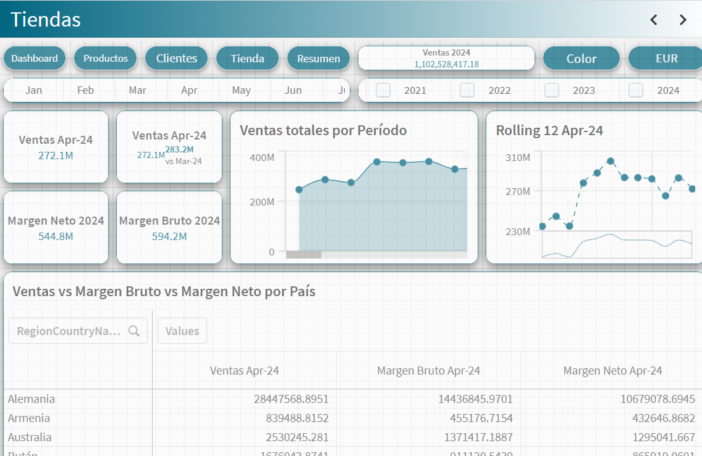
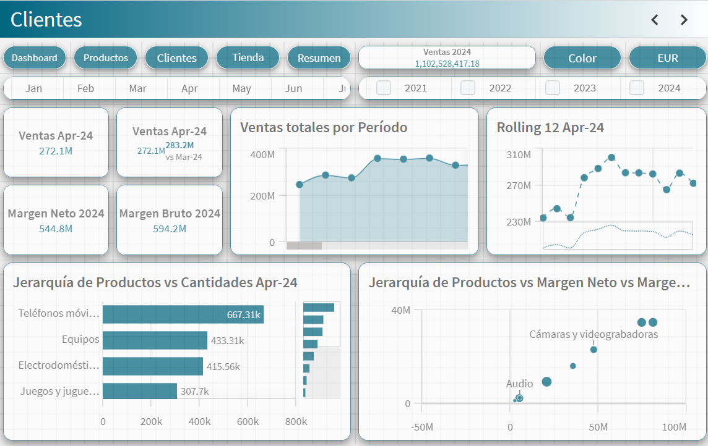

# 📊 Contoso Sales Analytics Dashboard

Este proyecto fue desarrollado en Qlik Sense como parte del Bootcamp de Jupi Digital. Tiene como finalidad construir una solución de inteligencia de negocios basada en el caso realista de Contoso, una empresa multinacional con estructura compleja, múltiples niveles de operación y una fuerza laboral global y móvil.

---

## 🧠 Contexto de Negocio

Contoso es una empresa con presencia internacional y la siguiente estructura organizacional:

- 🏢 **Headquarters**: sede central en París, con 25.000 empleados, incluyendo áreas administrativas, ingeniería y centros de datos.
- 🌍 **Centros Regionales**: conectados a la sede mediante WAN de alto ancho de banda, con foco en ventas y soporte.
- 🏬 **Oficinas Satélite**: representación local con el 80% del personal de ventas y soporte técnico. Conectadas a los centros regionales.

🔁 **El 25% de la fuerza laboral es exclusivamente móvil**, por lo que proporcionar soporte remoto optimizado es un objetivo clave.

**Retos técnicos identificados:**

- Diversidad geográfica con distintas normativas locales.
- Uso mixto de dispositivos (Windows, Mac, Linux, iOS, Android).
- Necesidad de seguridad para proteger datos confidenciales y propiedad intelectual.
- Alta demanda de analítica comercial para tomar decisiones en tiempo real.

---

## 🎯 Objetivos del Dashboard

El equipo comercial de Contoso definió los siguientes indicadores y necesidades para la solución de BI:

- **Indicadores clave**:
  - Sales Amount (monto de ventas)
  - Gross Margin (margen bruto)
  - Net Margin (margen neto)
  - Sales Quantity (cantidad vendida)
  - Budget Amount (presupuesto de ventas)

- **Visualizaciones requeridas**:
  - Variación % vs mismo mes del año anterior
  - Cumplimiento de presupuesto
  - Gráfico de tendencia mensual de ventas y márgenes (últimos 12 meses)
  - Mapa de clientes con mayor margen neto
  - Resumen por jerarquía de producto, país, y cliente
  - Análisis YTD vs Net Margin

---

## 🗂️ Datos Utilizados

- Hechos:
  - Ventas Online
  - Ventas en Tienda
  - Presupuesto

- Dimensiones:
  - Productos, Categorías, Subcategorías
  - Clientes, Tiendas, Territorios, Geografía
  - Segmentación RFM

- Fecha:
  - Calendario Maestro generado dinámicamente

---

## 🧪 Transformación y Modelado

- Se aplicó un modelo en estrella.
- Scripts personalizados en Qlik Sense:
  - Uso de `LEFT JOIN`, `LOAD precedentes`, `GROUP BY`
  - Agregaciones (`SUM`, `Net Margin`, `Gross Margin`)
  - Renombramiento de claves, prevención de sintéticas
  - Calendario completo con `MAKEDATE`, `RECNO`, `MONTHSTART`

---

## 📈 Dashboards y Visualizaciones

### 🔹 Dashboard General

### 🔹 Análisis por Tiendas

### 🔹 Análisis por Clientes

### 🔹 Análisis por Productos

Cada sección incluye KPIs dinámicos, filtros por periodo, moneda y tipo de análisis, además de visualizaciones interactivas como gráficos de dispersión, barras jerárquicas y mapas de calor.

---

## 👥 Público Objetivo

- Dirección Comercial
- Marketing y Ventas
- Planificación Estratégica

Este dashboard está diseñado para ofrecer insights ágiles y confiables para la toma de decisiones de negocio a distintos niveles organizacionales.

---

## 🛠️ Stack Tecnológico

- Qlik Sense SaaS
- QVDs para staging y almacenamiento intermedio
- Transformaciones avanzadas en script editor
- Visualizaciones customizadas y KPIs inteligentes

---

## ✍️ Autor

Desarrollado por **Octavio Alvarez**  
Bootcamp Qlik Sense – **Jupi Digital**

---

## 📎 Referencia

- Caso Contoso:  
  https://learn.microsoft.com/es-es/microsoft-365/enterprise/contoso-overview?view=o365-worldwide
